# Traffic Justice AI — Hands-on guide

**By [Indian AI Production](https://indianaiproduction.com/)** · [YouTube channel](https://www.youtube.com/indianaiproduction)

This guide helps you **understand** the project and **run it on a new computer** after cloning from GitHub. Read from top to bottom the first time; later, use the **table of contents** to jump.

**Live API reference (with the backend running):** [http://localhost:8000/docs](http://localhost:8000/docs)

**Use of this repo:** Study and personal learning are welcome. If you publish a **public fork** or share a copy, keep the **`LICENSE`** and **`NOTICE`** files and the **copyright lines in this README** — see [Part 14. Ethics and license](#part-14-ethics-and-license). (GitHub cannot block forks or renames; the license sets the rules for how the work may be shared.)

---

## Table of contents

1. [How this guide is organized](#how-this-guide-is-organized)
2. [Protecting keys and legal notice](#protecting-keys-and-legal-notice)
3. [Part 1. What this project is](#part-1-what-this-project-is)
4. [Part 2. Words you will see](#part-2-words-you-will-see)
5. [Part 3. What the app lets you do](#part-3-what-the-app-lets-you-do)
6. [Part 4. Technologies used](#part-4-technologies-used)
7. [Part 5. How the pieces connect](#part-5-how-the-pieces-connect)
8. [Part 6. Folder structure](#part-6-folder-structure)
9. [Part 7. How the AI routing works (LangGraph)](#part-7-how-the-ai-routing-works-langgraph)
10. [Part 8. What you need installed](#part-8-what-you-need-installed)
11. [Part 9. Setup on a fresh machine (step by step)](#part-9-setup-on-a-fresh-machine-step-by-step)
12. [Part 10. Quick health checks](#part-10-quick-health-checks)
13. [Part 11. First clicks in the UI](#part-11-first-clicks-in-the-ui)
14. [Part 12. Automated tests](#part-12-automated-tests)
15. [Part 13. If something goes wrong](#part-13-if-something-goes-wrong)
16. [Part 14. Ethics and license](#part-14-ethics-and-license)
17. [Checklist: Do I understand the project?](#checklist-do-i-understand-the-project)
18. [Ideas to try in the code](#ideas-to-try-in-the-code)
19. [Where to open which file](#where-to-open-which-file)
20. [Command cheat sheet](#command-cheat-sheet)
21. [Extra diagrams (reference)](#extra-diagrams-reference)

---

## How this guide is organized

| Section | Purpose |
|---------|---------|
| **Parts 1–4** | Big picture: idea, vocabulary, features, tech list. |
| **Part 5** | Diagrams: how browser, servers, and databases talk. |
| **Parts 6–7** | Code layout and how one AI “router” picks a specialist. |
| **Parts 8–10** | Install, configure, start, verify. |
| **Parts 11–14** | Use the app, run tests, fix issues, read ethics. |
| **End** | Checklist, file map, copy-paste commands, bonus diagrams. |

---

## Protecting keys and legal notice

- Never commit **`.env`**. Do not share **API keys**, **JWT secret**, or **evidence encryption key** in chat, recordings, or public repos.
- You need your own **OpenAI** key; watch **usage and billing** on your OpenAI account.
- This software is for **learning and transparency tools**. It is **not** a substitute for advice from a qualified lawyer.

---

## Part 1. What this project is

### In plain language

**Traffic Justice AI** is a small **full-stack product**:

- A **website** (Next.js) you open in the browser.
- A **Python API** (FastAPI) that holds secrets, talks to databases, and calls **OpenAI**.
- **PostgreSQL** for accounts, cases, challans, complaints, and similar records.
- **ChromaDB** as a **vector store**: legal text is split into chunks, turned into vectors, so search can match **meaning**, not only keywords.
- A **multi-step AI workflow** (LangGraph): one step figures out **what kind of question** it is, then **one specialist** handles it, then a **formatter** finishes the reply.

The **topic** is **Indian traffic law** (fines, rights, paperwork). The **pattern** is reusable for other domains that need search-over-documents plus routed AI steps.

### Why it is built this way

- **RAG** (retrieval-augmented generation): answers can use **your uploaded or bundled legal text**, not only what the model memorized.
- **Routing**: one central flow sends work to the right handler instead of one giant prompt for everything.

---

## Part 2. Words you will see

| Word | Simple meaning |
|------|----------------|
| **Frontend** | Code running in the browser; here, **Next.js**. |
| **Backend / API** | Server code; here, **FastAPI**. |
| **REST / JSON** | Browser or app calls URLs like `/api/v1/...` and gets **JSON** back. |
| **JWT** | Login returns tokens; the UI sends `Authorization: Bearer …` on protected calls. |
| **Docker Compose** | One command starts several containers (database, API, UI, …). |
| **PostgreSQL** | Main relational database for users, cases, challans, etc. |
| **ChromaDB** | Vector database for **semantic** search over text chunks. |
| **Embedding** | A list of numbers representing text; similar text → similar numbers. |
| **RAG** | **R**etrieve relevant chunks → put them in the prompt → **g**enerate an answer. |
| **LLM** | Large language model; here **GPT-4o** through OpenAI. |
| **LangGraph** | A small **graph** of steps with **shared state** (the “router + specialist” engine). |
| **Intent** | A label like `legal_query` or `evidence_analysis` that **picks** which specialist runs. |

---

## Part 3. What the app lets you do

| Area | What happens |
|------|----------------|
| **Legal Q&A** | Your question → search **Chroma** for relevant chunks → **GPT-4o** answers using **`backend/app/rag/prompts.py`**. |
| **Challan check** | You enter sections/amounts → compared to **JSON** fine lists under **`backend/data/fine_schedules/`**. |
| **Evidence** | **Upload** saves an **encrypted** file + database row. **`POST /api/v1/evidence/{id}/analyze`** runs **Whisper** for audio/video if needed, then the **evidence** specialist analyzes the text. |
| **Cases** | Organize **cases** and link **challans** / **evidence**; API under **`/api/v1/cases`**. |
| **Complaints** | Draft, edit, submit via **`/api/v1/complaints`**; optional **PDF** and **email / portal** helpers in **`services/`**. |
| **Analytics** | Endpoints under **`/api/v1/analytics`** (heatmap, patterns, etc.). Some are **public** for anonymous stats — see **`backend/app/api/v1/analytics.py`**. |

---

## Part 4. Technologies used

| Layer | What |
|-------|------|
| **Website** | Next.js 14.x, TypeScript, Tailwind, axios, TanStack Query; maps/charts on analytics pages |
| **API** | FastAPI, SQLAlchemy (async), Alembic, SlowAPI (rate limits) |
| **AI** | LangChain, LangGraph, OpenAI **GPT-4o**, embeddings, **Whisper** for audio |
| **Vector DB** | ChromaDB (version pinned in `requirements.txt` and Docker image) |
| **Main database** | PostgreSQL 16 |
| **Redis** | Started by Compose; **client code exists**; **no API route depends on it yet** |
| **Also in backend** | **fpdf2** (PDFs), **Playwright** (optional portal tooling), **arq** (listed for future async work) |
| **Local run** | **Docker Compose** |

**Graph “specialists” (one runs per request after routing):** classifier → **one of** legal / challan / evidence / complaint / portal / tracker → formatter.

**Important detail:** the usual **challan** button in the UI calls **`POST /api/v1/challan/validate`** → **`challan_service`** directly (no LangGraph). The **challan** graph node exists for other flows that call **`run_orchestrator`** with challan data.

---

## Part 5. How the pieces connect

### Diagrams: if you see code instead of a picture

Diagrams use **Mermaid**. On **github.com** they usually render automatically. In **VS Code / Cursor**, install something like **Markdown Preview Mermaid Support** and open the Markdown preview again.

### Simple path (legal help example)

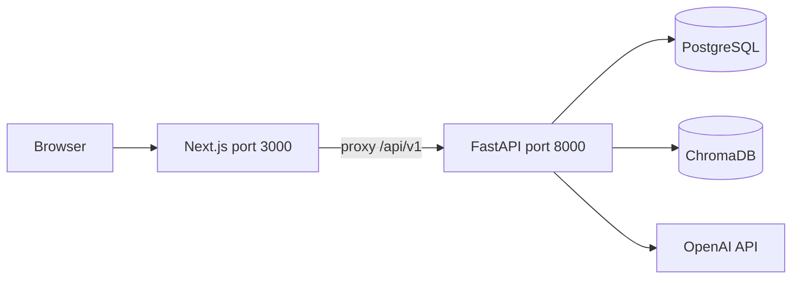

The website talks to **Next.js** on port **3000**. Paths starting with **`/api/v1`** are **forwarded** to **FastAPI** on **8000** (see **`BACKEND_INTERNAL_URL`** in Docker / **`frontend/next.config.js`**).

### Docker services (what runs where)

| Service | Port on your machine | Role |
|---------|----------------------|------|
| **frontend** | 3000 | UI + proxy to API |
| **backend** | 8000 | FastAPI, agents, RAG |
| **postgres** | 5432 | App data |
| **redis** | 6379 | Ready for future cache/queues |
| **chromadb** | **8001** (maps to 8000 inside the container) | Vectors |
| **pgadmin** | 5050 | Optional DB UI — use a strong password if you expose it |

### Full platform (one screen)

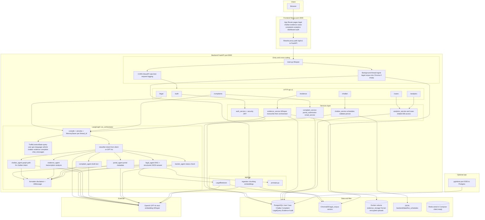

**Reading tips**

- **Solid arrows** = normal request flow.
- **Challan from the form** usually goes **API → challan_service → JSON files + Postgres** (no graph).
- **Legal Q&A** goes through **run_orchestrator → legal_agent → Chroma + GPT-4o → formatter**.
- **Evidence**: upload stores files; **Analyze** can call **Whisper**, then the graph with **`evidence_analysis`**.
- On startup, **`main.py`** may **ingest** the legal corpus into Chroma if the collection is empty (plus you can run ingestion manually — see Part 9).

---

## Part 6. Folder structure

```
traffic_justice_ai/              ← repo root (docker-compose.yml lives here)
├── LICENSE                      ← copyright and sharing rules (keep when you fork)
├── NOTICE                       ← short attribution (keep when you fork)
├── docker-compose.yml
├── .env.example                 ← copy to .env (never commit real .env)
├── README.md
├── backend/
│   ├── app/
│   │   ├── main.py            ← FastAPI app, startup, background Chroma ingest
│   │   ├── config.py          ← settings from environment
│   │   ├── dependencies.py    ← JWT / current user
│   │   ├── agents/            ← orchestrator, specialists, tools/
│   │   ├── api/v1/            ← HTTP routes + router.py
│   │   ├── core/              ← logging, security, middleware, errors
│   │   ├── db/                ← database session, Redis client
│   │   ├── rag/               ← ingest, retrieve, prompts, embeddings
│   │   ├── services/
│   │   ├── models/
│   │   └── schemas/
│   ├── data/
│   │   ├── legal_corpus/      ← text/PDF sources for Chroma
│   │   └── fine_schedules/    ← per-state JSON (+ central, index)
│   ├── alembic/
│   ├── tests/
│   ├── requirements.txt
│   └── run_ingestion.py       ← manual Chroma load (startup may also ingest)
├── frontend/
│   └── src/
│       ├── app/               ← pages: auth, dashboard, legal-help, challan, cases, …
│       ├── components/
│       ├── hooks/
│       └── lib/               ← api.ts, auth helpers
└── scripts/                   ← helpers: validate fines, seed data, etc.
```

Most edits happen under **`backend/app`** and **`frontend/src`**.

---

## Part 7. How the AI routing works (LangGraph)

### Idea in one sentence

Every orchestrated call runs: **classify (or trust the intent)** → **run exactly one specialist** → **format the answer** → **done**.

### Picture of the graph

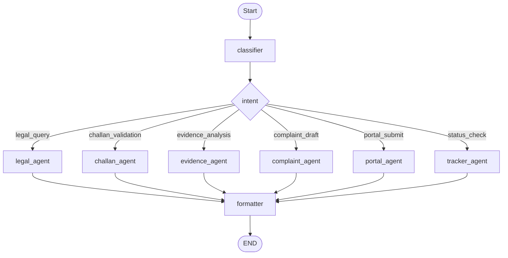

### Pipeline (same skeleton every time)

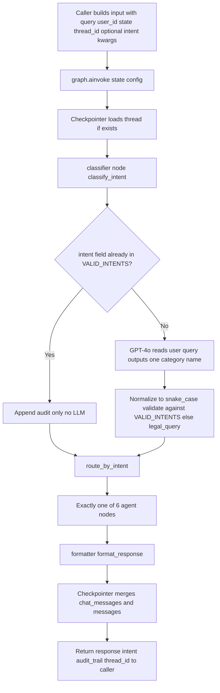

| Step | What happens |
|------|----------------|
| 1 | **`run_orchestrator`** fills **`TrafficJusticeState`** (query, user, place, language, optional intent, extra fields like transcription). |
| 2 | **`MemorySaver`** stores **chat** per **`thread_id`** (in **process memory** — restart clears it). |
| 3 | **Classifier** uses the given **intent** or asks **GPT-4o** once. |
| 4 | **Router** maps the intent string to one **Python node**. |
| 5 | That node writes **`response`**. |
| 6 | **Formatter** adds disclaimer text and updates **`chat_messages`**. |

### Intent → which file node

| Intent | Node | Main inputs (typical) |
|--------|------|------------------------|
| `legal_query` | `legal_agent` | query, state, language, vehicle, chat history |
| `challan_validation` | `challan_agent` | challan sections, state |
| `evidence_analysis` | `evidence_agent` | transcription |
| `complaint_draft` | `complaint_agent` | case text, evidence summary, language |
| `portal_submit` | `portal_agent` | complaint draft, state |
| `status_check` | `tracker_agent` | complaint id |

**Main code:** **`backend/app/agents/orchestrator.py`**, **`backend/app/agents/state.py`**.

**Classifier rules (short):** if **`intent`** is already valid, no extra LLM call; else GPT-4o classifies the **`query`**; unknown → **`legal_query`**.

**RAG for legal:** build a search query → **`LegalRetriever`** + **Chroma** → fill **`LEGAL_QUERY_TEMPLATE`** in **`prompts.py`** → **GPT-4o** JSON → formatter.

**Tools folder:** **`backend/app/agents/tools/`** — some agents call services directly; tools help experiments and extensions.

---

## Part 8. What you need installed

| Item | Check |
|------|--------|
| **Docker Desktop** | `docker --version` |
| **Docker Compose v2** | `docker compose version` |
| **Git** | `git --version` |
| **OpenAI API key** | [platform.openai.com/api-keys](https://platform.openai.com/api-keys) |
| **RAM** | ~4 GB free for Docker; more is smoother |
| **Disk** | ~3 GB for first image download |

**Windows:** use **WSL2** with Docker Desktop if you can.

---

## Part 9. Setup on a fresh machine (step by step)

Do these **in order**. After each block, run the “**You should see**” line if one is given.

### Step 1. Clone the repo

```bash
git clone <YOUR_GITHUB_REPO_URL> traffic_justice_ai
cd traffic_justice_ai
```

**You should see** the folder **`traffic_justice_ai`** with **`docker-compose.yml`**, **`backend/`**, **`frontend/`**.

### Step 2. Create `.env` from the example

```bash
cp .env.example .env
```

Open **`.env`** in an editor. You will fill secrets in Step 3.

### Step 3. Set three required secrets

| Variable | What it is for |
|----------|----------------|
| **`OPENAI_API_KEY`** | Chat, embeddings, Whisper |
| **`JWT_SECRET_KEY`** | Signs login tokens (long random string) |
| **`EVIDENCE_ENCRYPTION_KEY`** | Encrypts uploaded evidence files (Fernet key) |

**JWT secret (Mac / Linux / Git Bash):**

```bash
openssl rand -hex 32
```

**Fernet key (needs Python + cryptography once):**

```bash
pip install cryptography
python -c "from cryptography.fernet import Fernet; print(Fernet.generate_key().decode())"
```

**PowerShell (random string — you can also use OpenSSL for Windows if installed):**

```powershell
-join ((65..90) + (97..122) + (48..57) | Get-Random -Count 64 | ForEach-Object {[char]$_})
```

Leave **`POSTGRES_*`**, **`CHROMA_*`**, **`REDIS_*`** as in **`.env.example`** unless you changed **`docker-compose.yml`**.

### Step 4. Start all containers

```bash
docker compose up --build -d
```

Wait until containers are **healthy**. Optional: watch logs until the API is quiet:

```bash
docker compose logs -f backend
```

**You should see** no crash loop; **`http://localhost:8000/health`** should respond after a short wait (Part 10).

### Step 5. Create database tables (migrations)

```bash
docker compose exec backend alembic upgrade head
```

**You should see** Alembic “Running upgrade …” messages.

### Step 6. Load legal text into Chroma (vector DB)

```bash
docker compose exec backend python run_ingestion.py
```

**Note:** the backend may also **auto-ingest** on startup if Chroma is empty. Running this step **manually** makes sure chunks exist.

If chunk count is **zero**, add files under **`backend/data/legal_corpus/`** or read **`backend/app/rag/ingestion.py`** to see what it picks up.

### Step 7. (Optional) Validate fine JSON on your host

Needs Python with dependencies installed locally:

```bash
python scripts/validate_fine_data.py
```

### Step 8. Stop for the day (optional)

```bash
docker compose down
```

Data usually **stays** in Docker **volumes** until you delete them.

---

## Part 10. Quick health checks

| Check | Command or URL |
|-------|----------------|
| API alive | Browser or `curl http://localhost:8000/health` |
| Interactive API docs | [http://localhost:8000/docs](http://localhost:8000/docs) |
| Website | [http://localhost:3000](http://localhost:3000) |
| Redis | `docker compose exec redis redis-cli ping` → `PONG` |
| Chroma | `curl http://localhost:8001/api/v1/heartbeat` |
| Postgres tables | `docker compose exec postgres psql -U traffic_justice -d traffic_justice_db -c "\dt"` |

---

## Part 11. First clicks in the UI

1. Open **[http://localhost:3000](http://localhost:3000)**.
2. **Register**, then **log in**.
3. Open **Legal help**. Try a question in plain language (Roman Hindi works with the prompts), for example:  
   - *Mere paas DL nahi hai aur police ne pakda.*  
   - *Police ₹10000 maang rahe hain — sahi hai?*  
4. Ask a **follow-up** in the same thread — the UI keeps **`thread_id`** so context can continue.
5. Open **[http://localhost:8000/docs](http://localhost:8000/docs)** — try **`GET /health`**, then an authenticated route with a **Bearer** token if you want to see raw JSON.
6. Explore **Cases**, **Challan**, **Evidence** (upload, then click **Analyze**), **Complaints**, **Analytics**.  
   - **Postgres** = structured app data.  
   - **Chroma** = legal corpus for **RAG** only.

**Legal answers path:** Chroma chunks → **`prompts.py`** template → **GPT-4o** → optional save in Postgres.

---

## Part 12. Automated tests

```bash
docker compose exec backend python -m pytest tests -q
```

Tests use **SQLite** for speed; real runs use **Postgres**.

Optional lint:

```bash
docker compose exec backend pip install ruff
docker compose exec backend python -m ruff check app
```

---

## Part 13. If something goes wrong

| Problem | What to try |
|---------|-------------|
| Diagrams in README show raw text | Open the file on **GitHub**, or add a **Mermaid** preview extension in the editor. |
| Frontend or API errors | `docker compose ps` and `docker compose logs backend` |
| Weak or empty legal answers | Re-run **Step 6** (ingestion); check Chroma volume |
| Tests fail | Run pytest **inside** the **backend** container (command above) |
| Port already in use | Stop the other app, or change ports in **Compose** |
| **404** on some URLs | Trailing slash matters: **`redirect_slashes=False`** — e.g. use **`/api/v1/cases`** not **`/api/v1/cases/`** for list/create |

---

## Part 14. Ethics and license

### Use of the product

The project is meant to support **lawful, informed** use. It does **not** help evade legitimate penalties or encourage unsafe conflict with authorities. **Outputs are not legal advice.**

### Who built this

| | |
|--|--|
| **Publisher** | **Indian AI Production** |
| **Website** | [https://indianaiproduction.com/](https://indianaiproduction.com/) |
| **YouTube** | [https://www.youtube.com/indianaiproduction](https://www.youtube.com/indianaiproduction) |
| **Project name** | **Traffic Justice AI** (please keep attribution when sharing forks or copies) |

### Copyright and sharing rules

- **Copyright © 2026 Indian AI Production.** All rights reserved.
- **License text:** see the **`LICENSE`** file in the repository root.
- **Short attribution file:** **`NOTICE`** (keep it with the project when you redistribute).
- **Personal / classroom-style learning:** cloning and local changes for practice are expected.
- **Public forks or reposts:** you must **not** delete or hide **`LICENSE`**, **`NOTICE`**, or the **publisher block at the top of this README**. That way the original author stays visible even if the GitHub repository has a different name.
- **Selling or commercial hosting** of this codebase as your own product needs **written permission** from Indian AI Production (contact via the website).

**Plain note:** A public Git repository **cannot be locked** so that nobody renames a fork. What you *can* do is publish a **clear license** (above) and point learners to the **official** repo and channel so the real source stays obvious.

### Third-party software

Libraries (for example Next.js, FastAPI, OpenAI client) stay under **their** licenses. This project’s **original teaching materials and layout of the app** are covered by **`LICENSE`** as stated there.

---

## Checklist: Do I understand the project?

You can explain:

1. How **Next.js** sends **`/api/v1`** traffic to **FastAPI**.  
2. What **RAG** means and why **Chroma** exists.  
3. How **LangGraph** differs from a single huge LLM call.  
4. How **JWT** protects routes.  
5. What **Docker Compose** starts on your machine.

---

## Ideas to try in the code

- Follow **`POST /api/v1/legal/query`** into **`run_orchestrator`** and **`legal_agent`**.  
- Change prompts in **`backend/app/rag/prompts.py`** and compare answers.  
- Add a field to **`GET /health`** or a small analytics endpoint.  
- Draw your own **classifier → one specialist → formatter** graph for another topic.

---

## Where to open which file

| Goal | Path |
|------|------|
| HTTP routes | `backend/app/api/v1/`, `router.py` |
| Settings | `backend/app/config.py`, `.env.example` |
| Login / tokens | `backend/app/dependencies.py`, `core/security.py` |
| Agents | `backend/app/agents/` (`orchestrator.py`, `state.py`, `tools/`) |
| Prompts | `backend/app/rag/prompts.py` |
| RAG | `ingestion.py`, `retriever.py`, `embeddings.py` |
| Complaints / PDF / portals | `pdf_service.py`, `portal_submission.py`, `portal_registry.py` |
| DB migrations | `backend/alembic/` |
| Frontend API client | `frontend/src/lib/api.ts` |
| Proxy to backend | `frontend/next.config.js` |

---

## Command cheat sheet

```bash
docker compose up --build -d
docker compose exec backend alembic upgrade head
docker compose exec backend python run_ingestion.py
docker compose exec backend python -m pytest tests -q
```

| URL | Purpose |
|-----|---------|
| [http://localhost:3000](http://localhost:3000) | Website |
| [http://localhost:8000](http://localhost:8000) | API |
| [http://localhost:8000/docs](http://localhost:8000/docs) | Swagger UI |

---

## Extra diagrams (reference)

### Layers inside the backend (simple)

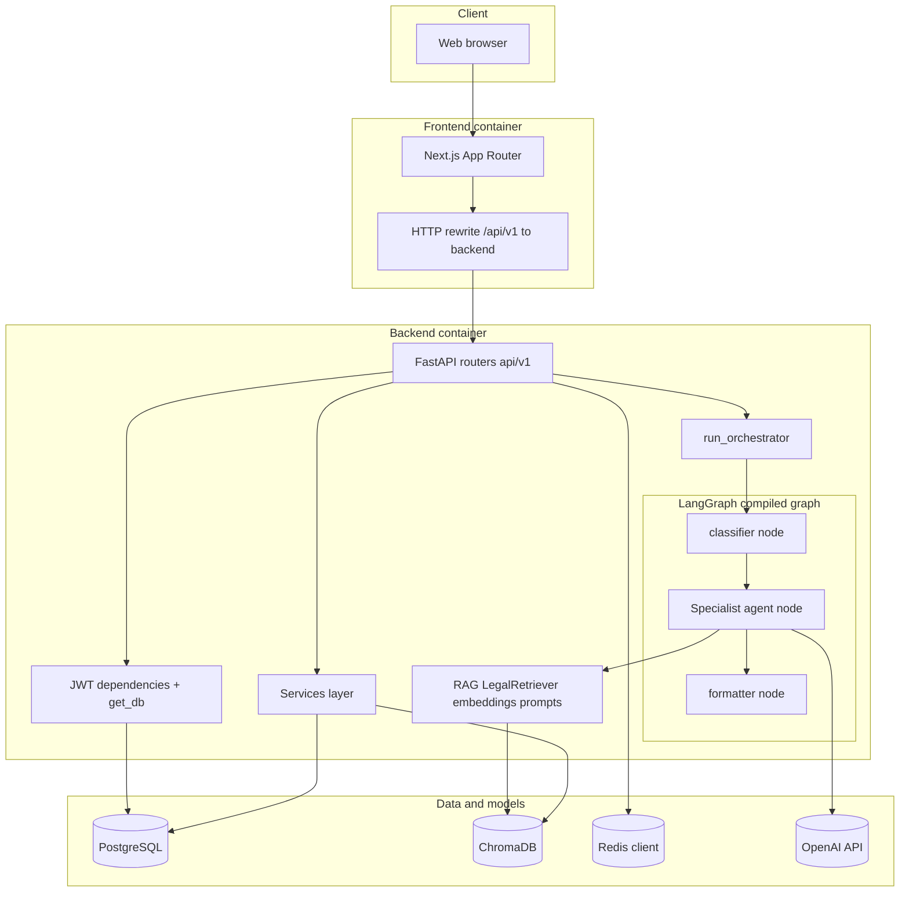

### Legal Q&A sequence (example)

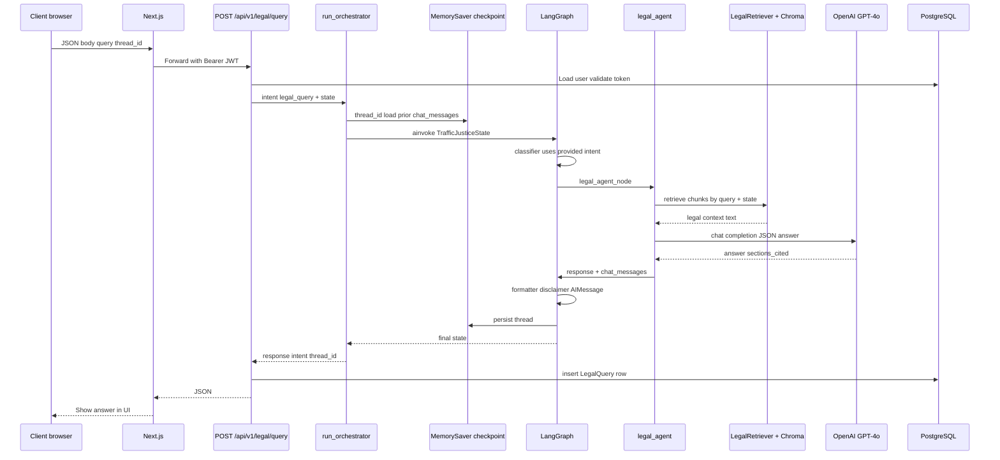

### Docker Compose topology

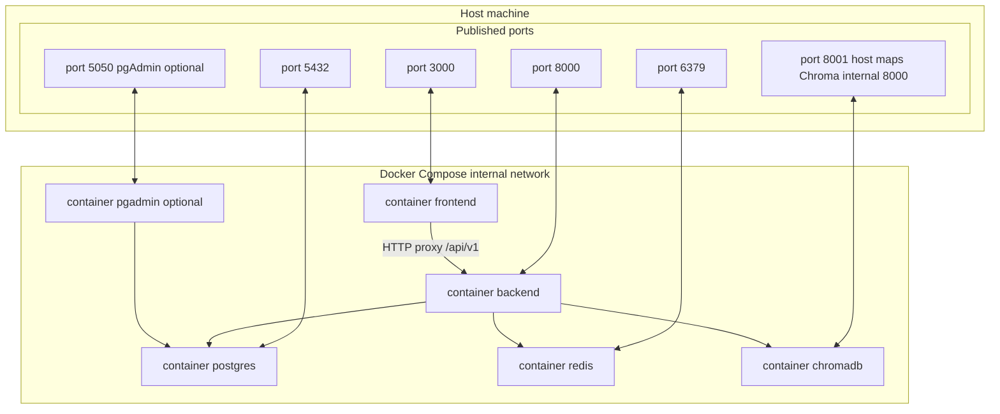

**Volumes:** `postgres_data`, `redis_data`, `chroma_data`, `evidence_storage` — usually survive `docker compose down` until you remove volumes.

### Backend module map

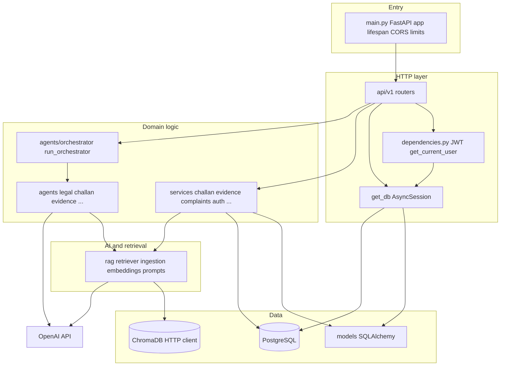

### RAG: load documents vs answer a question

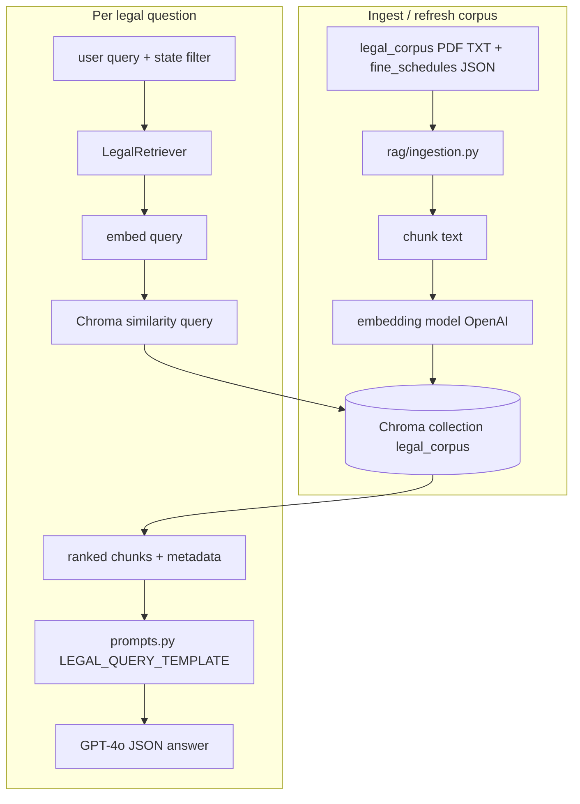

### Login and Bearer token

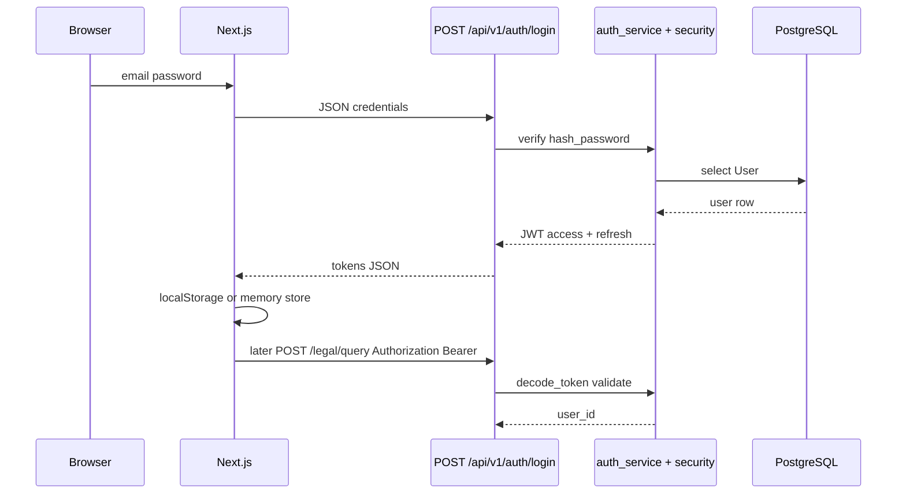

### Challan validate (direct API, no LangGraph)

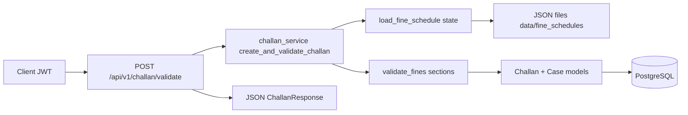

### Evidence: upload, then analyze

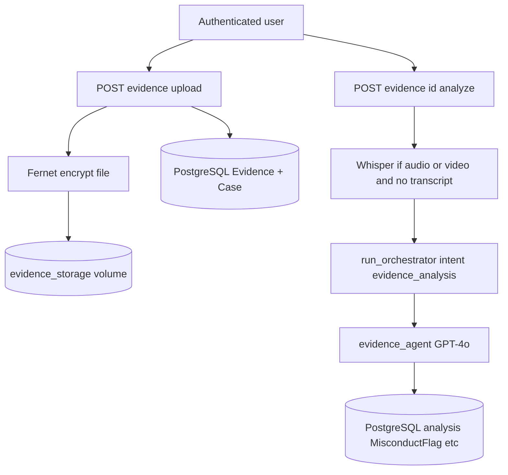

### Intent → graph node (mapping)

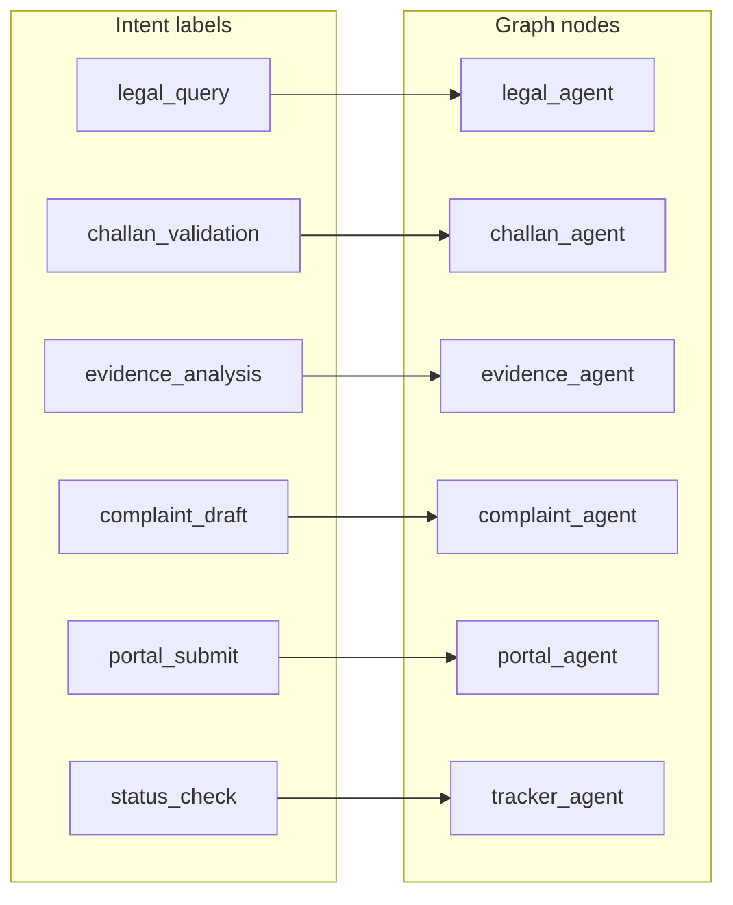

### Per-intent mini flows

| Intent | How intent is set (typical) | Inside the specialist |
|--------|----------------------------|------------------------|
| **`legal_query`** | **`POST /api/v1/legal/query`** sets intent, or classifier infers it | Chroma retrieve + **`LEGAL_QUERY_TEMPLATE`** + GPT-4o JSON |
| **`challan_validation`** | **`run_orchestrator`** with challan payload (no dedicated public graph-only route today) | **`validate_fines`** vs JSON schedules |
| **`evidence_analysis`** | **`analyze_evidence_transcription`** after Whisper | **`EVIDENCE_ANALYSIS_PROMPT`** + GPT-4o |
| **`complaint_draft`** | Complaints draft API | **`COMPLAINT_DRAFT_PROMPT`** + GPT-4o |
| **`portal_submit`** | Orchestrator with draft in state | **`resolve_submission_target`**, portal metadata |
| **`status_check`** | Orchestrator with **`complaint_id`** | Stub status in **`tracker_agent`** |

**Outside the graph:** **`POST /api/v1/challan/validate`** → **`challan_service`** → Postgres (same product, simpler path).

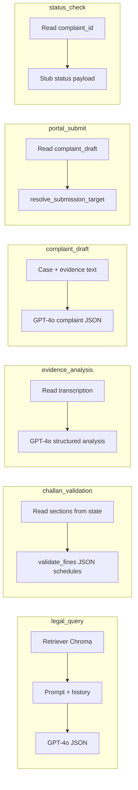

---

*End of guide.*
